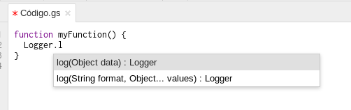
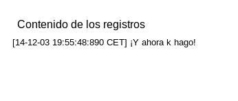

Usando Google App Scripts
=============================

## Objetivos

1. Conocer los conceptos generales del Software como Servicio (*SaaS*).
2. Crear *scripts* simples en Javascript.
3. Conocer el modelo de objetos de Google App Engine y usarlo en
   programas simples.

## Empecemos por el principio

[Software as a Service o SaaS](http://es.wikipedia.org/wiki/Software_como_servicio)
es un modelo de uso de software en el cual parte, o toda, la lógica de
la aplicación está en la web. Podemos denominar SaaS tanto a las
apliaciones ricas de Internet (con un interfaz como el de cualquiera
aplicación de escritorio) como a aplicaciones *clásicas* basadas en
formularios, pero en propiedad se corresponde más a las primeras.

Las aplicaciones en modo SaaS están sustituyendo hoy en día a la
mayoría de las aplicaciones de escritorio e, igual que en estas el
modelo habitual (en aplicaciones privativas) es de pago por licencia,
en el modelo SaaS se suele pagar por su implantación y,
posteriormente, por uso en diferentes modalidades, tarifa plana o por
intensidad de uso.

Muchas aplicaciones, además, son un *marco* sobre el cual se pueden
desarrollar funcionalidades adicionalees. A modo de sistema operativo,
ofrecen una serie de servicios a los que se puede acceder a modo de
*plugins* o *addons*. Los lenguajes usados para esto son generalmente
Javascript u otros lenguajes *empotrados* como Lua, aunque algunos
servicios pueden tener lenguajes propios o simplemente no permitir
nuevas funcionalidades.

Las que lo permiten, como Google Drive, se convierten en plataformas
donde se pueden desarrollar verdaderas aplicaciones.

> Discutir diferentes SaaS de uso habitual y sus ventajas e
> inconvenientes frente a aplicaciones de escritorio.

## Intro a Google Drive

[Google Drive](http://drive.google.com) es una suite ofimática y de
aplicaciones de Google que incluye las aplicaciones ofimáticas
básicas, más una serie de aplicaciones conectables como GeoGebra,
MindMeister e incluso un corregidor de ortografía, estilo y
gramática. Muchas de ellas son gratuitas, pero en realidad se trata de
una nueva plataforma de distribución y de creación de software en la
nube.

Como se ha visto anteriormente, a un nivel muy básico una aplicación
en la nube es simplemente un formulario. Los formularios de Google
Drive están conectados a una hoja de cálculo y automáticamente crean
gráficos con las respuestas.

Dentro de la hoja de cálculo donde se depositan las respuestas, se
pueden crear tablas dinámicas. Estas tablas dinámicas son fáciles de
crear y, en muchos casos, permiten realizar informes de forma
dinámica.

> Crear un formulario que permita, por ejemplo, introducir respuestas
> a una encuesta. Examinar la hoja de respuestas y crear un informe de
> tabla dinámica (Datos->Informe de Tabla dinámica)

Una de las aplicaciones más desconocidas y más útiles son las Tablas
Dinámicas de Google (o *Fusion Tables*). Se puede usar como punto de
partida una hoja de cálculo qeu tengamos almacenada, pero tiene
también una serie de demos que muestran lo que es capaz de
hacer. Aparte de presentar la información de la hoja de diferentes
formas, es capaz de situarla sobre un mapa y de crear todo tipo de
visualizaciones sobre la misma.

Lo interesante de todas estas aplicaciones es que van a ser accesibles
desde los *scripts* y por tanto podremos trabajar con ellas
dinámicamente o acceder a unas desde otras, usando todas sus funciones
como si de una librería se tratara. Lo veremos a continuación, después de ver un par de cosas, la primera de las cuales es

## El modelo de objetos

Un sistema operativo incluye una serie de llamada que permite a los
programas que se ejecutan sobre él acceder a las funciones del
sistema: abrir y cerrar ficheros, reservar memoria y todas las
operaciones de mayor o menor nivel.

Los entornos de operación modernos incluyen una gama de posibiliades
mucho mayor que el simple sistema operativo; también cambian de
paradigma del procedural al orientado a objetos; en general, los
sistemas operativos u entornos gráficos modernos incluyen un modelo de
objetos (OM) al que se puede acceder desde el lenguaje preferido y,
por supuesto, desde cualquier otra aplicación a la que se exponga el
interfaz de programación (API). El navegador tiene un
[DOM](http://es.wikipedia.org/wiki/Document_Object_Model), un modelo
de objetos para documentos, que incluye una serie de objetos ya
instanciados como `document` o `window`.

Generalmente, un SaaS extensible como las Google Apps tienen una serie
de objetos que permiten usar los llamados
[servicios](https://developers.google.com/apps-script/guides/services/)
de Google Apps. Todas las aplicaciones básicas y avanzadas tienen uno,
y a veces varios objetos, y estos servicios se suelen llamar
`AlgoApp`. Por ejemplo, Google Drive tiene
[`DriveApp`](https://developers.google.com/apps-script/reference/drive/)
y las hojas de cálculo la
[`SpreadsheetApp`](https://developers.google.com/apps-script/reference/spreadsheet/spreadsheet-app). Todos
estos objetos están instanciados y accesibles a todos los scripts que
vayamos a usar. Pero antes, tendremos que aprender sobre los

> Buscar los objetos correspondientes a las diferentes aplicaciones de
> Google Drive. ¿Cómo se llaman? ¿Cuantos tiene cada uno? 

## Métodos de autenticación

Cuando se trabaja en la nube se está trabajando con un interfaz de
aplicación, un API, igual que en el sistema operativo; en éste hay una
jerarquía de privilegios que te permiten activar, o no, diferentes
funciones y esos privilegios afectan por un lado a los usuarios y por
otro lado a los programas. Un usuario *autoriza* a un programa a
ejecutarse y acceder a sus recursos (sistema de ficheros, la red)
simplemente ejecutándolo. El permiso es implícito.

Sin embargo, en la nube el entorno es un poco más complicado. Primero,
porque muchos programas se ejecutan también desde la misma nube y el
considerar que hay una autorización implícita puede ser un poco
peligroso. Segundo, porque los recursos están compartimentalizados y
se puede decidir de forma granular a qué recursos se tiene acceso.

Por eso generalmente se usa, igual que en el móvil cuando se instala
una aplicación, un proceso de autorización explícita; en casi todos
los casos se usa un sistema llamado
[OAuth2](https://developer.github.com/v3/oauth_authorizations/#create-a-new-authorization). En
la práctica, eso significa que hay dos conjuntos de claves

* Una clave y un *secreto* por aplicación.
* Una clave y un *secreto* por usuario que autorice.

Por eso se suele hacer un sistema de autorización en dos pasos: en un
primer paso se descargan (generalmente del portal del desarrollador)
la clave y el secreto y, cada vez que se accede a un nuevo usuario,
este tiene que autorizarlo explícitamente, con lo que le *concede* a
la aplicación la segunda clave y secreto.

Dependiendo del sistema que usemos, esto habrá que hacerlo y
almacenarlo por parte de nuestro programa. En el caso de Google App,
simplemente veremos que, cuando un usuario ejecuta por primera vez un
*script*, tiene que autorizarlo. Lo que haremos justamente a
continuación, cuando ejecutemos

## Nuestro primer programa en la nube

[Google Script](https://script.google.com/) es a la vez un entorno de
programación que nos permite crear y ejecutar nuestro programa. Vamos
a por el primero, el clásico hola mundo. Si creamos un script en
blanco, nos saldrá algo así; el entorno completa los nombres de las
funciones para aquellas que estén declaras:

El primer programa se reduce a lo siguiente:

	function myFunction() {
	  Logger.log("¡Ola k ase!");
	}

Como podéis ver, es una función que se tiene que llamar precisamente
así, `myFunction` y que no recibe ningún parámetro. Es Javascript, que
es el lenguaje de *macros* de este entorno. Esta función será el
equivalente al `main` de otros lenguajes: es la función que se llama
al arrancar el script; puedes cambiarle el nombre, pero hasta que no
guardes no podrás ejecutarla.

Y contiene una sola orden,
`Logger.log("¡Ola k ase!");`. [`Logger` es uno de los objetos estándar de GAS](https://developers.google.com/apps-script/reference/base/logger),
disponible para todos y cada uno de los scripts que usemos y es un
registro de las acciones de cada programa. No nos queda más remedio
que usar esto para salida, al menos para empezar. Los *scripts* en GAS
no tienen salida estándar y por tanto no pueden simplemente usar el
`writeln` de JS o el `console.log` (sinceramente, esto no lo he
probado). `log` añade una línea a ese registro, simplemente.

Se puede ejecutar directamente con la flechita que aparece al lado del
bicho (que es, lo pillasteis, para depurar o desenbichar). Te pedirá
que le asignes un nombre y luego se olvidará de que querías
ejecutarlo, así que luego lo ejecutas.

Y no pasa nada. Le das de nuevo a ejecutar. Sigue sin pasar nada. ¿Qué
ocurre? Nada. No, es broma. Ocurre que, efectivamente, donde pasa algo
es en el registro, al que se accede dando a Control-Enter o al menú
Ver -> Registros. Saldrá algo así:

> Escribir un script que escriba en el registro una tabla de
> multiplicar de un número determinado.

Desde los scripts tenemos también acceso a la librería estándar de
Javascript. Por ejemplo, a `JSON`, la librería para procesar las
estructuras de datos de JS y transformarlas a cadenas y viceversa.

    var foo = [1,2,3, {clave: "Valor"}];
    Logger.log(JSON.stringify(foo));

La segunda línea convierte a una cadena la estructura de datos
compleja `foo`, lo que puede ser útil a la hora de depurar una
aplicación *a la antigua*, imprimiendo variables aparte de "Estoy por
aquí", "No debería estar aquí", y todo eso.

Valga lo anterior como prueba de que la clase JSON está incluida en la
librería estándar, aunque en realidad `Logger.log(foo)` haría
exactamente lo mismo (con un resultado ligeramente diferente). No
[todas las clases (objetos globales) de JS](https://developer.mozilla.org/en-US/docs/Web/JavaScript/Reference/Global_Objects)
están presentes en el GAS, pero sí los principales. 

##Vamos a hacer algo

El script anterior no hace nada, pero es un ejemplo de un tipo de
script denominado
[*standalone*](https://developers.google.com/apps-script/guides/standalone),
útil principalmente para usar el sistema como plataforma de
cómputo. Pero, como se ha visto antes, estos scripts son los
equivalentes a los de `bash` o de cualquier intérprete de
comandos. Nos permiten acceder a lo que tenemos en el sistema. Por
ejemplo, a los ficheros que tengamos en Google Drive, como vamos a
hacer a continuación. Por ejemplo, podemos buscar los ficheros que
correspondan a un determinado criterio.

	function myFunction() {
	  var ficheros = DriveApp.getFiles();
	  while (ficheros.hasNext()) {
		var este_fichero = ficheros.next();
		Logger.log(este_fichero.getName());
	  }
	}

Este fichero es una transcripción directa del
[ejemplo en la guía de referencia](https://developers.google.com/apps-script/reference/drive/). Simplemente
lista el nombre de los ficheros que tengamos en drive. Usa `DriveApp`
y una función de la misma (que aparecerá en un desplegable cuando lo
escribamos), [`getFiles`](https://developers.google.com/apps-script/reference/drive/drive-app#getFiles%28%29) que, evidentemente, lo que devuelve es un *iterador* a los
ficheros que tengamos en el drive, [clase `FileIterator`](https://developers.google.com/apps-script/reference/drive/file-iterator). Por eso no se
recorre simplemente un array, sino que se usa la función `hasNext`
para acceder al siguiente fichero de la lista; el bucle terminará
cuando no haya más ficheros. El mismo iterador se usa también para
recuperar el siguiente elemento, `next` pasa el cursor al siguiente
elemento del iterador y devuelve un objeto de tipo
[`File`](https://developers.google.com/apps-script/reference/drive/file),
usando la metáfora del *drive* o disco como contenedor de *ficheros*.

Para ejecutar este script, incluso aunque sea nuestro, Google Drive
nos pedirá autorización, ya que estamos trabajando con un servicio
plasmado en el objeto `DriveApp`. El *pop-up* te indicará qué permisos
concedes, que irán en función de las funciones que ejecutes de ese
objeto. Evidentemente, hay que darle permiso y al ejecutarse, nos
pondrá en el registro los nombres de los ficheros.

Esto podemos complicarlo un poquito más:

	function colaboradores() {
	  var ficheros = DriveApp.getFiles();
	  var colaboradores = new Object;
	  var ficheros_array = new Object;
	  while (ficheros.hasNext()) {
		var este_fichero = ficheros.next();
		colaboradores[este_fichero] = este_fichero.getEditors();
		Logger.log(colaboradores[este_fichero]);
	  }

	}

En este caso, lo que hacemos es usar una variable asociativa
(`colaboradores`) para almacenar los editores que cada fichero tiene,
usando otra de las funciones del objeto. Usamos Logger, pero tambien
puede resultar útil otra función: Ver -> Transcripción de la
ejecución, que nos explicita qué se ha hecho en cada momento y cuanto
ha tardado cada ejecución, inclusive el objetivo final. Si tenemos
muchos ficheros puede tardar un rato; consultando en este registro
(que está activo siempre) podemos ver qué es lo que lo ha
retrasado. En concreto, en mi Drive tarda varios minutos en terminar
de ejecutarse, y obtengo algo así:

	[14-12-04 14:05:06:349 CET] (class).next() [0 segundos]
	[14-12-04 14:05:06:476 CET] File.getEditors() [0,126 segundos]
	[14-12-04 14:05:06:477 CET] Logger.log([[DriveUser], []]) [0 segundos]
	[14-12-04 14:05:06:477 CET] (class).hasNext() [0 segundos]
	[14-12-04 14:05:06:478 CET] (class).next() [0 segundos]
	[14-12-04 14:05:06:698 CET] File.getEditors() [0,22 segundos]
	[14-12-04 14:05:06:698 CET] Logger.log([[DriveUser], []]) [0 segundos]
	[14-12-04 14:05:06:699 CET] (class).hasNext() [0 segundos]
	[14-12-04 14:05:06:699 CET] (class).next() [0 segundos]
	[14-12-04 14:05:06:804 CET] File.getEditors() [0,105 segundos]
	[14-12-04 14:05:06:805 CET] Logger.log([[], []]) [0 segundos]
	[14-12-04 14:05:06:805 CET] (class).hasNext() [0 segundos]
	[14-12-04 14:05:06:805 CET] (class).next() [0 segundos]
	[14-12-04 14:05:06:936 CET] File.getEditors() [0,13 segundos]
	[14-12-04 14:05:06:937 CET] Logger.log([[DriveUser, DriveUser, DriveUser], []]) [0 segundos]
	[14-12-04 14:05:06:937 CET] (class).hasNext() [0 segundos]
	[14-12-04 14:05:06:938 CET] (class).next() [0 segundos]
	[14-12-04 14:05:07:149 CET] File.getEditors() [0,211 segundos]
	[14-12-04 14:05:07:150 CET] Logger.log([[], []]) [0 segundos]
	[14-12-04 14:05:07:151 CET] (class).hasNext() [0 segundos]
	[14-12-04 14:05:07:151 CET] (class).next() [0 segundos]
	[14-12-04 14:05:07:340 CET] File.getEditors() [0,188 segundos]
	[14-12-04 14:05:07:340 CET] Logger.log([[], []]) [0 segundos]
	[14-12-04 14:05:07:341 CET] (class).hasNext() [0 segundos]
	[14-12-04 14:05:07:348 CET] Ejecución correcta [325.825 segundos de tiempo de ejecución total]

Como se ve, cada petición de `getEditor` tarda un ratico (casi dos
décimas de segundo la última), un quinto de 
segundo, lo que hace que al final tarde todo casi cinco
minutos. Cuidado, por tanto, con este tipo de peticiones, sobre todo
si tiene uno que esperar al resultado, porque pueden emplear una buena
cantidad de tiempo. Por otro lado, si miramos el resultado es un poco
decepcionante, porque aparece sólo DriveUser, así que tendremos que
modificarlo para que nos dé el nombre de usuario; al menos con esto
sabemos cuantos colaboradores hay:

	function colaboradores() {
	  var ficheros = DriveApp.getFiles();
	  var datos = new Object;
	  var ficheros_array = new Object;
	  while (ficheros.hasNext()) {
		var este_fichero = ficheros.next();
		var este_ID = este_fichero.getId();
		var editores = este_fichero.getEditors();
		if ( editores.length > 0 ) {
		  datos[este_ID] = { eds: editores,nombre: este_fichero.getName() };
		  datos[este_ID].eds.map( function (ed) {
			Logger.log("Ed " + ed.getEmail());
		  });
		}
	  }

	  var ficheros_por_colaboradores = Object.keys(datos).sort( function( a, b ) {
		return datos[b].eds.length - datos[a].eds.length;
	  } );

	  for ( var i in ficheros_por_colaboradores ) {
		Logger.log( datos[ficheros_por_colaboradores[i]].nombre + ": " + datos[ficheros_por_colaboradores[i]].eds.length );
	  } 

	}

De camino, también ordenamos los ficheros por número de colaboradores (editores),
lo que hace la función `compara_num_colaboradores`. Aquí hay un poco
de programación funcional en JS, además por partida doble. Primero,
usamos `map`, una función que aplica, a su vez, una función a cada uno
de los elementos de un array. En este caso la función es un *closure* o función
anónima, básicamente una función que declaramos sobre la
marcha. También se pasa una función así a `sort`: es la función que se
usa para clasificar y que en este caso lo hace según el número de
colaboradores (longitud del array).

> Realizar un script que recupere el *peso* de cada uno de los
> ficheros almacenados en el Drive y liste sólo los PDFs.

##Trabajando con varios documentos

Finalmente (por hoy) podemos trabajar con varios documentos. Cada tipo
de documento tiene un servicio y, por ejemplo, podemos almacenar los
colaboradores en una hoja de cálculo para más adelante trabajar con
ellos:

	function colaboradores() {
	  var ficheros = DriveApp.getFiles();
	  var hoja_destino = SpreadsheetApp.openById('Aquí-un-id-hoja-creada-antes');
	  var colaboradores = new Object;
	  var ficheros_array = new Object;
	  while (ficheros.hasNext()) {
		var este_fichero = ficheros.next();
		colaboradores[este_fichero] = este_fichero.getEditors();
		var this_row = [ este_* con fichero ];
		colaboradores[este_fichero].map( function( ed ) {
		  this_row.push( ed.getEmail() );
		});
		hoja_destino.appendRow( this_row );
	  } 
	}

Aquí usamos `SpreadsheetApp` y abrimos usando el ID (una parte del URL
que se ve en la barra del navegador). El programa es similar al
anterior, pero en este caso usamos el objeto `hoja_destino` para
añadirle una fila `appendRow` con el nombre del fichero y los
colaboradores. Usamos `push` para crear un *array* con los elementos
que vamos a añadir como nueva fila de la hoja, que será variable en
cada caso. Tendremos como resultado una hoja con todos los documentos,
un montón en mi caso, y los colaboradores que hay en cada uno de ellos.

> *Contar* el peso de los ficheros en un  [documento de texto](https://developers.google.com/apps-script/reference/document/), de esta
> forma: "El fichero x tiene y megas.".

## Añadiendo los scripts a un documento

Algunos SaaS como Google Drive o, más propiamente, Google Apps,
permiten crear también aplicaciones que trabajen con los datos y
objetos que forman parte del mismo. Todos estos sistemas suelen
incluir algún lenguaje de *scripting* y, en general, se suele tratar
de JavaScript.

El nivel de control que tiene uno sobre las aplicaciones es bastante
variado. Se puede desde usar Google Drive como un PaaS para alojar
aplicaciones hasta simplemente añadir pequeños *scripts* que lleven a
cabo alguna labor como [cambiar el interfaz de usuario o añadir
funcionalidad a alguna aplicación de Google Drive](https://developers.google.com/apps-script/overview).

Crear un *script* para un documento en Google Drive es similar a hacer una macro para
una aplicación. Se hace de la forma siguiente

1. Ir a Herramientas -> Editor de secuencias de comandos. Se abre un
   entorno de desarrollo para *scripts* en el que ya está prerrellena
   la función que la añade al menú y a la que se llama.
2. Se edita la función, se guarda y se publica.
3. Se vuelve a abrir el documento correspondiente. Aparecerá un menú
   nuevo, *Script Center Menu*, que incluirá un enlace con el nombre
   de la aplicación.
4. Cuando se ejecute por primera vez, pedirá que se autorice su uso.

Por ejemplo, se puede asociar el siguiente *script* a una hoja de
cálculo:

	function summarize_projects() {
	  var sheet = SpreadsheetApp.getActiveSheet();
	  var output_sheet = SpreadsheetApp.openById("un_id_largo")
	  var rows = sheet.getDataRange();
	  var numRows = rows.getNumRows();
	  var values = rows.getValues();

	  // Delete output.
	  var output_range = output_sheet.getDataRange().getNumRows();
	  Logger.log(output_range);
	  output_sheet.deleteRows(1, output_range);
	  for (var i = 1; i < numRows; i++) {
		output_sheet.appendRow([values[i][1],values[i][3],values[i][19]]);
	  }
	};

	function onOpen() {
	  var spreadsheet = SpreadsheetApp.getActiveSpreadsheet();
	  var entries = [{
		name : "Resume proyectos",
		functionName : "summarize_projects"
	  }];
	  spreadsheet.addMenu("Programillas", entries);
	};

De las dos funciones, miremos primero la segunda, `onOpen`, que crea
  una opción del menú en la hoja de cálculo en la que nos encontremos
  (`getActiveSpreadsheet`). Crea un menú llamado "Programillas", con
  una sola entrada, "Resume proyectos", que llama a la otra función.

La otra función, `summarize_projects` es la que hace todo el trabajo: en este caso, lee de una hoja de cálculo (de proyectos inscritos en un concurso) y extrae sólo unas columnas: la 1, la 3 y la 19, que son las que contienen información genérica. Para que no se vaya añadiendo siempre al final, sino que se reescriba, tenemos que borrar el contenido de la web (`deleteRows`) y luego, con `appendRow`, igual que hemos hecho antes, añadir las filas en forma de array (con un elemento con columna).

La principal diferencia con los ejemplos anteriores está en que estamos alterando el interfaz de usuario, añadiendo un nuevo desplegable, y también en la forma de usar el documento actual en el que estamos; habrá una función similar para cada uno de los tipos de documento.

> Cread un script para una hoja de cálculo que resuma el contenido en
> un documento externo, por ejemplo diciendo algo así como "La fila x
> tiene como columna y el contenido z". Cread previamente el documento
> en el que se vaya a incluir este texto. 

## Concluyendo

Google Drive permite tomar un primer contacto con el desarrollo de
aplicaciones en la nube, al nivel *SaaS*, el superior (o inferior,
según se mire). Los scripts pueden ir desde
la simple utilidad aplicada a un documento, hasta lo muy complejo que se puede publicar en la tienda de
*apps*, convirtiéndo a la plataforma SaaS  en un nuevo modo de distribución de
software. Y básicamente lo que hay que conocer es JavaScript y un poco
del modelo de objetos.

